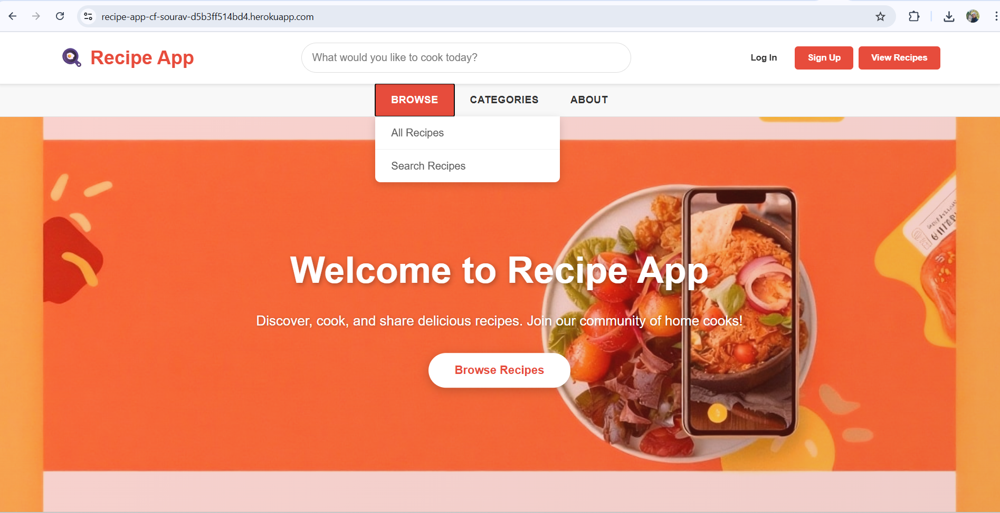

# Recipe App - Django Full-Stack Web Application

A comprehensive recipe management and discovery platform built with Django, featuring user authentication, advanced search, data visualization, and a modern responsive UI.

## 🚀 Live Demo
**Live Application:** [https://recipe-app-cf-sourav-d5b3ff514bd4.herokuapp.com/](https://recipe-app-cf-sourav-d5b3ff514bd4.herokuapp.com/)

**Test Credentials:**
- Username: `testuser`
- Password: `example@123`

## 📋 Table of Contents
- [Features](#features)
- [Technologies Used](#technologies-used)
- [Installation](#installation)
- [Usage](#usage)
- [Testing](#testing)
- [Deployment](#deployment)
- [Project Structure](#project-structure)
- [API Documentation](#api-documentation)
- [Contributing](#contributing)
- [License](#license)

## ✨ Features

### Core Functionality
- **User Authentication**: Secure login/logout/signup system with protected views
- **Recipe Management**: Create, read, and view recipes (full CRUD operations)
- **Advanced Search**: 
  - Search by recipe name (partial match, case-insensitive)
  - Filter by ingredient (searches in comma-separated ingredients)
  - Filter by difficulty level (Easy, Medium, Intermediate, Hard)
  - Multiple chart visualization options
- **Data Visualization**: Interactive charts using matplotlib
  - **Bar Chart**: Cooking time comparison across recipes
  - **Pie Chart**: Recipe distribution by difficulty level
  - **Line Chart**: Cooking time trends
- **Responsive Design**: Mobile-friendly UI with modern styling
- **Custom Admin Panel**: Enhanced Django admin interface with red gradient theme

### Additional Features
- ✅ Automatic difficulty calculation based on cooking time and ingredient count
- ✅ Recipe detail pages with complete information and ingredient lists
- ✅ Navigation menu with login/logout states
- ✅ About Me page with developer information and social links
- ✅ Search results displayed as formatted tables with pagination
- ✅ Professional styling with CSS gradients and hover animations
- ✅ Recipe categories (Breakfast, Lunch, Dinner, Dessert, Snack)
- ✅ Image upload support (optional for recipes)
- ✅ User-specific recipe ownership tracking

## 🛠️ Technologies Used

### Backend
- **Python**: 3.12.8
- **Django**: 5.2.7
- **Database**: 
  - SQLite3 (development)
  - PostgreSQL (production - Heroku)

### Data Analysis & Visualization
- **pandas**: 2.3.3 - Data manipulation and analysis
- **matplotlib**: 3.10.7 - Chart generation (bar, pie, line)
- **Pillow**: 12.0.0 - Image processing

### Deployment & Production
- **Heroku**: Cloud platform hosting
- **Gunicorn**: 23.0.0 - WSGI HTTP server
- **WhiteNoise**: 6.11.0 - Static file serving
- **psycopg2-binary**: 2.9.11 - PostgreSQL adapter
- **dj-database-url**: 3.0.1 - Database configuration
- **django-storages**: 1.14.4 - S3 storage backend
- **boto3**: 1.35.71 - AWS SDK for Python

### Frontend
- **HTML5** - Semantic markup
- **CSS3** - Modern styling with gradients and animations
- **Django Templates** - Server-side rendering

### Testing & Quality
- **Django TestCase**: 39 comprehensive tests
- **coverage**: 7.11.0 - Code coverage analysis (85% coverage)
- **Git**: Version control

## 📦 Installation

### Prerequisites
- Python 3.14 or higher
- pip (Python package manager)
- Virtual environment (recommended)
- Git

### Local Setup

1. **Clone the repository**
```bash
git clone https://github.com/souravdas090300/recipe-app.git
cd recipe-app
```

2. **Create and activate virtual environment**
```bash
# Windows
python -m venv web-dev
web-dev\Scripts\activate

# macOS/Linux
python3 -m venv web-dev
source web-dev/bin/activate
```

3. **Navigate to project directory**
```bash
cd recipe_project
```

4. **Install dependencies**
```bash
# From the repository root
pip install -r recipe_project/requirements/dev.txt
```

5. **Run migrations**
```bash
python manage.py migrate
```

6. **Create superuser**
```bash
python manage.py createsuperuser
```

7. **Load sample data (optional)**
```bash
python manage.py load_sample_recipes
```

8. **Run development server**
```bash
python manage.py runserver
```

9. **Access the application**
- Homepage: http://127.0.0.1:8000/
- Admin Panel: http://127.0.0.1:8000/admin/
- Recipes List: http://127.0.0.1:8000/recipes/ (login required)

## 🎯 Usage

### For Regular Users

1. **Visit the Homepage**
   - Navigate to the live URL or local server
   - Browse the welcome page with app features

2. **Create an Account**
   - Click "Sign Up" button
   - Enter username and password (confirm password)
   - Automatically logged in after registration

3. **Search and Browse Recipes**
   - Click "View Recipes" or navigate to `/recipes/`
   - Use search form to filter recipes:
     - Enter recipe name (partial match supported)
     - Search by ingredient (e.g., "chicken", "tomato")
     - Filter by difficulty level
     - Select chart type for visualization
   - Click "Search" to view results

4. **View Recipe Details**
   - Click on any recipe name in the results table
   - View complete recipe information:
     - Cooking time
     - Difficulty level (auto-calculated)
     - Ingredients list
     - Description/instructions
     - Recipe image (if available)
     - Category

5. **Add New Recipes**
   - Navigate to "Add Recipe" (requires login)
   - Fill in recipe details:
     - Name
     - Cooking time (in minutes)
     - Ingredients (comma-separated)
     - Description
     - Category (optional)
     - Upload image (optional)
   - Click "Submit" to create recipe

6. **View Data Visualizations**
   - After searching, charts automatically generate
   - Three chart types available:
     - **Bar Chart**: Compare cooking times across recipes
     - **Pie Chart**: See distribution by difficulty
     - **Line Chart**: View cooking time trends
   - Charts update dynamically based on search results

### For Administrators

1. **Access Admin Panel**
   - Navigate to `/admin/`
   - Login with superuser credentials
   - Example accounts:
     - `testuser` (test account)
     - `admin` (administrator account)

2. **Manage Recipes**
   - View all recipes in database
   - Search by name or ingredients
   - Filter by user, category, or cooking time
   - Edit recipe details
   - Delete recipes
   - View computed difficulty

3. **Manage Users**
   - Create new user accounts
   - Manage permissions
   - View user activity

4. **Admin Panel Features**
   - Custom red gradient theme
   - Enhanced search capabilities
   - List filters for easy navigation
   - "Go to Homepage" quick link

## 🧪 Testing

### Run All Tests
```bash
# Navigate to project directory
cd recipe_project

# Run complete test suite
python manage.py test apps.recipe

# Expected output: 39 tests, all passing
```

### Run Specific Test Files
```bash
# Test models only
python manage.py test apps.recipe.tests.test_models

# Test views only
python manage.py test apps.recipe.tests.test_views

# Test forms only
python manage.py test apps.recipe.tests.test_forms

# Test search functionality
python manage.py test apps.recipe.tests.test_recipes_views
```

### Run with Coverage Report
```bash
# Install coverage (if not already installed)
pip install coverage

# Run tests with coverage tracking
coverage run --source='.' manage.py test apps.recipe

# View coverage report in terminal
coverage report

# Generate HTML coverage report
coverage html
# Open htmlcov/index.html in browser
```

### Test Coverage Summary
```
Total Tests: 39
Pass Rate: 100%
Code Coverage: 85%

Test Breakdown:
- Model Tests: 8 tests (Recipe model functionality)
- View Tests: 15 tests (List, detail, create views)
- Form Tests: 8 tests (RecipeSearchForm validation)
- Integration Tests: 8 tests (Search, pagination, filtering)
```

### What's Being Tested
- ✅ Recipe model creation and validation
- ✅ Difficulty calculation logic (Easy/Medium/Intermediate/Hard)
- ✅ Ingredients list parsing from CSV
- ✅ User authentication requirements
- ✅ Search functionality (name, ingredient, difficulty)
- ✅ Chart generation (bar, pie, line)
- ✅ Form validation and rendering
- ✅ Pagination across search results
- ✅ Recipe detail view display
- ✅ Admin panel access control

## 🌐 Deployment

### Live Deployment on Heroku

**Production URL:** https://recipe-app-cf-sourav-d5b3ff514bd4.herokuapp.com/

**App Details:**
- **App Name**: recipe-app-cf-sourav
- **Region**: US
- **Stack**: heroku-24
- **Database**: PostgreSQL (essential-0)
- **Dyno**: 1 web dyno
 - **Buildpacks**: Subdir buildpack (PROJECT_PATH=recipe_project), heroku/python

### Deploy Your Own Instance

#### Prerequisites
- Heroku account ([sign up here](https://signup.heroku.com/))
- Heroku CLI ([install here](https://devcenter.heroku.com/articles/heroku-cli))
- Git installed

#### Step-by-Step Deployment

**1. Prepare Your Local Repository**
```bash
# Clone the repository
git clone https://github.com/souravdas090300/recipe-app.git
cd recipe-app

# Ensure you're on the main branch
git checkout main
```

**2. Login to Heroku**
```bash
heroku login
```

**3. Create Heroku App (subdirectory deployment)**
```bash
cd recipe_project
heroku create your-unique-app-name
```

Add the Subdir buildpack and set the project path so Heroku builds from the `recipe_project` folder:
```bash
heroku buildpacks:add https://github.com/timanovsky/subdir-heroku-buildpack
heroku buildpacks:add heroku/python
heroku config:set PROJECT_PATH=recipe_project
```

**4. Add PostgreSQL Database**
```bash
heroku addons:create heroku-postgresql:essential-0
```

**5. Set Environment Variables**
```bash
# Generate a secret key (use Python)
python -c "from django.core.management.utils import get_random_secret_key; print(get_random_secret_key())"

# Set the secret key
heroku config:set DJANGO_SECRET_KEY="your-generated-secret-key"

# Set allowed hosts
heroku config:set DJANGO_ALLOWED_HOSTS="your-unique-app-name.herokuapp.com"

# Set CSRF trusted origins
heroku config:set DJANGO_CSRF_TRUSTED_ORIGINS="https://your-unique-app-name.herokuapp.com"

# Enable security settings
heroku config:set DJANGO_SECURE_SSL_REDIRECT=true
heroku config:set DJANGO_SESSION_COOKIE_SECURE=true
heroku config:set DJANGO_CSRF_COOKIE_SECURE=true
```

**6. Deploy to Heroku**
```bash
# Ensure Procfile exists in recipe_project directory
# Content: web: gunicorn config.wsgi --log-file -

# Push to Heroku
git push heroku main
```

**7. Run Database Migrations**
```bash
heroku run python recipe_project/manage.py migrate
```

**8. Create Superuser**
```bash
heroku run python recipe_project/manage.py createsuperuser
```

**9. Load Sample Data (Optional)**
```bash
heroku run python recipe_project/manage.py load_sample_recipes
```

**10. Open Your App**
```bash
heroku open
```

### Environment Variables (Production)

Required configuration variables:
```
DJANGO_SECRET_KEY           # Django secret key (keep this secret!)
DJANGO_ALLOWED_HOSTS        # Comma-separated list of allowed hosts
DJANGO_CSRF_TRUSTED_ORIGINS # HTTPS URL of your app
DATABASE_URL                # Auto-set by Heroku PostgreSQL addon
DJANGO_SECURE_SSL_REDIRECT  # Set to "true" for HTTPS redirect
DJANGO_SESSION_COOKIE_SECURE # Set to "true" for secure cookies
 DJANGO_CSRF_COOKIE_SECURE   # Set to "true" for secure CSRF cookies
 USE_S3                      # Set to "true" to enable S3 media storage
 AWS_ACCESS_KEY_ID           # IAM user access key
 AWS_SECRET_ACCESS_KEY       # IAM user secret key
 AWS_STORAGE_BUCKET_NAME     # Your S3 bucket name
 AWS_S3_REGION_NAME          # Bucket region, e.g. eu-central-1
```

### Production Files

**Procfile** (in recipe_project directory):
```
web: gunicorn config.wsgi --log-file -
```

**Python version file**:
- Heroku is deprecating `runtime.txt`. Prefer `.python-version` in the project root.
   - Example content: `3.14`

**Requirements files**:
- Dependencies are split by environment under `recipe_project/requirements/`:
   - `base.txt` (shared)
   - `dev.txt` (development extras)
   - `prod.txt` (production extras: gunicorn, whitenoise, dj-database-url, psycopg2-binary, boto3, django-storages)

### Troubleshooting Deployment

**Issue: 503 Service Unavailable**
- Check Procfile is in correct directory
- Verify Procfile has correct command
- Check Heroku logs: `heroku logs --tail`

**Issue: 400 Bad Request**
- Verify DJANGO_ALLOWED_HOSTS is set correctly
- Check that your domain is included

**Issue: 403 CSRF Verification Failed**
- Ensure DJANGO_CSRF_TRUSTED_ORIGINS is set
- Use HTTPS URL (not HTTP)

### 📚 Production Documentation

For comprehensive production deployment guides and tools, see:

- **[DEPLOYMENT.md](recipe_project/DEPLOYMENT.md)** - Complete deployment guide with step-by-step instructions for Heroku, AWS S3 setup, database management, monitoring, and troubleshooting
- **[PRODUCTION_CHECKLIST.md](recipe_project/PRODUCTION_CHECKLIST.md)** - Pre-deployment checklist covering configuration, security, testing, and post-deployment verification
- **[SECURITY.md](recipe_project/SECURITY.md)** - Security best practices, current security posture review, recommended improvements, and incident response procedures
- **[.env.example](recipe_project/.env.example)** - Environment variables template with detailed descriptions and quick reference commands

#### Quick Setup Scripts

- **Windows**: Run `recipe_project\setup_heroku.ps1` to interactively configure Heroku
- **Linux/Mac**: Run `recipe_project/setup_heroku.sh` to interactively configure Heroku
- **Configuration Check**: Run `python recipe_project/check_production.py` to verify your production setup

#### Quick Deployment Commands

```bash
# Configure environment (interactive)
cd recipe_project
./setup_heroku.sh  # or setup_heroku.ps1 on Windows

# Deploy
git push heroku main

# Run migrations
heroku run python manage.py migrate --settings=config.settings.prod

# Create superuser
heroku run python manage.py createsuperuser --settings=config.settings.prod
```

**Issue: Static Files Not Loading**
- Verify whitenoise is installed
- Check STATIC_ROOT in settings
- Run `python manage.py collectstatic`

**View Logs:**
```bash
heroku logs --tail
```

**Restart App:**
```bash
heroku restart
```

### Media Storage: AWS S3 (Production)

This app stores user-uploaded media (recipe images) on Amazon S3 in production.

1) Install dependencies (already included in `prod.txt`):
- `django-storages==1.14.4`
- `boto3==1.35.71`

2) Configure IAM and S3
- Create an S3 bucket (e.g. `recipe-app-media-<your-suffix>`) in your region (e.g. `eu-central-1`).
- Create an IAM user for the app (programmatic access) and attach S3 permissions (e.g. AmazonS3FullAccess for testing; restrict later).
- In the S3 Bucket → Permissions:
   - Uncheck "Block all public access" if you want public read access to images.
   - Bucket policy to allow public GET and your IAM user access:

   ```json
   {
      "Version": "2012-10-17",
      "Statement": [
         {
            "Sid": "PublicReadGetObject",
            "Effect": "Allow",
            "Principal": "*",
            "Action": "s3:GetObject",
            "Resource": "arn:aws:s3:::YOUR_BUCKET_NAME/*"
         }
      ]
   }
   ```

   - CORS configuration (optional, for browser uploads):

   ```json
   [
      {
         "AllowedHeaders": ["*"],
         "AllowedMethods": ["GET", "HEAD"],
         "AllowedOrigins": ["*"]
      }
   ]
   ```

3) Set Heroku config vars
```bash
heroku config:set USE_S3=true \
   AWS_ACCESS_KEY_ID=YOUR_KEY \
   AWS_SECRET_ACCESS_KEY=YOUR_SECRET \
   AWS_STORAGE_BUCKET_NAME=YOUR_BUCKET_NAME \
   AWS_S3_REGION_NAME=eu-central-1 \
   --app your-unique-app-name
```

4) Django settings (already wired)
- Production settings (`config/settings/prod.py`) use `STORAGES` with `config.storage_backends.MediaStorage`.
- S3 uses a regional endpoint: `https://<bucket>.s3.<region>.amazonaws.com/media/`.
- ACLs are disabled (`AWS_DEFAULT_ACL = None`). Use bucket policy for public read.

5) Verify S3 connectivity (optional)
- A helper script `recipe_project/test_s3.py` can be run on Heroku:
```bash
heroku run "python test_s3.py" --app your-unique-app-name
```
- Remove the script after verification in production environments.

6) Common S3 errors
- `AccessControlListNotSupported`: Remove ACLs; set `AWS_DEFAULT_ACL = None` and rely on bucket policy.
- `403 Forbidden` on HeadObject/PutObject: Check IAM permissions, bucket policy, or region mismatch.
- Wrong URLs or 404: Ensure regional endpoint and `MEDIA_URL` are correct.

7) Security
- Never commit AWS credentials. If keys are exposed, deactivate and rotate them immediately in IAM, then update Heroku config vars.

## 📁 Project Structure

```
recipe-app/
├── Exercise-2.8/                   # Exercise submission folder
│   ├── README.md                   # Exercise documentation
│   ├── TESTING_REPORT.md           # Comprehensive test coverage report
│   ├── learning-journal.md         # Weekly learning reflections
│   ├── learning-journey.md         # Overall learning journey
│   └── screenshots/                # Application screenshots
│       ├── 1-homepage.png
│       ├── 2-recipes-list.png
│       ├── 3-search-results-chart.png
│       ├── 4-recipe-detail.png
│       ├── 5-add-recipe.png
│       ├── 6-admin-panel.png
│       └── 7-about-page.png
│
├── docs/                           # Project documentation
│   └── CODE_DOCUMENTATION.md       # Comprehensive code documentation
│
├── recipe_project/                 # Django project root
│   ├── apps/                       # Django applications
│   │   └── recipe/                 # Main recipe application
│   │       ├── management/         # Custom management commands
│   │       │   └── commands/
│   │       │       └── load_sample_recipes.py  # Load 15 sample recipes
│   │       ├── migrations/         # Database migrations
│   │       │   ├── 0001_initial.py
│   │       │   ├── 0002_alter_recipe_user.py
│   │       │   ├── 0003_alter_recipe_pic.py
│   │       │   ├── 0004_alter_recipe_pic.py
│   │       │   └── 0005_recipe_category.py
│   │       ├── templates/recipe/   # HTML templates
│   │       │   ├── recipes_home.html      # Homepage with hero section
│   │       │   ├── recipes_list.html      # Search and list view
│   │       │   ├── recipe_detail.html     # Individual recipe page
│   │       │   ├── recipe_form.html       # Add recipe form
│   │       │   └── about.html             # About developer page
│   │       ├── tests/              # Test files (39 tests, 85% coverage)
│   │       │   ├── __init__.py
│   │       │   ├── test_models.py          # Model tests (8 tests)
│   │       │   ├── test_views.py           # Basic view tests (2 tests)
│   │       │   ├── test_forms.py           # Form tests (8 tests)
│   │       │   ├── test_recipes_views.py   # Recipe view tests (13 tests)
│   │       │   └── test_recipe_list_detail.py  # List/detail tests (8 tests)
│   │       ├── __init__.py
│   │       ├── admin.py            # Admin configuration (custom styling)
│   │       ├── apps.py             # App configuration
│   │       ├── forms.py            # RecipeSearchForm
│   │       ├── models.py           # Recipe model with difficulty calculation
│   │       ├── urls.py             # App URL patterns
│   │       ├── utils.py            # Chart generation utilities
│   │       └── views.py            # View classes and functions
│   │
│   ├── config/                     # Project configuration
│   │   ├── settings/               # Split settings
│   │   │   ├── __init__.py
│   │   │   ├── base.py             # Base settings
│   │   │   ├── dev.py              # Development settings (SQLite)
│   │   │   └── prod.py             # Production settings (PostgreSQL)
│   │   ├── __init__.py
│   │   ├── asgi.py                 # ASGI configuration
│   │   ├── urls.py                 # Project URL configuration
│   │   ├── views.py                # Authentication views (login/signup/logout)
│   │   └── wsgi.py                 # WSGI configuration
│   │
│   ├── config/storage_backends.py  # S3 media storage backend
│   │
│   ├── templates/                  # Project-level templates
│   │   ├── admin/                  # Admin customization
│   │   │   └── base_site.html      # Custom admin theme (red gradient)
│   │   └── auth/                   # Authentication templates
│   │       ├── login.html          # Login page
│   │       ├── signup.html         # User registration page
│   │       └── success.html        # Logout success page
│   │
│   ├── media/                      # User-uploaded files (not in git)
│   │   └── recipes/                # Recipe images
│   │
│   ├── static/                     # Static files (CSS, JS, images)
│   │   └── recipe/                 # App-specific static files
│   │
│   ├── htmlcov/                    # Coverage report (generated)
│   │   └── index.html              # HTML coverage report
│   │
│   ├── .coverage                   # Coverage data file
│   ├── db.sqlite3                  # SQLite database (development only)
│   ├── manage.py                   # Django management script
│   ├── Procfile                    # Heroku process file
│   ├── runtime.txt                 # Python version for Heroku
│   └── requirements.txt            # Python dependencies
│
├── .gitignore                      # Git ignore rules
└── README.md                       # This file
```

### Key Files Explained

**Models (recipe_project/apps/recipe/models.py)**
- Recipe model with fields: name, cooking_time, ingredients, description, category, pic, user
- Methods: `difficulty()`, `ingredients_list()`, `get_absolute_url()`
- Fully documented with comprehensive docstrings

**Views (recipe_project/apps/recipe/views.py)**
- `home()` - Homepage view
- `about()` - About page view
- `RecipeListView` - List recipes with search/filter and charts
- `RecipeDetailView` - Display single recipe
- `RecipeCreateView` - Add new recipes

**Forms (recipe_project/apps/recipe/forms.py)**
- `RecipeSearchForm` - Search by name, ingredient, difficulty, chart type

**Utils (recipe_project/apps/recipe/utils.py)**
- `get_chart()` - Generate matplotlib charts (bar, pie, line)
- `get_graph()` - Convert plot to base64 for HTML embedding
- `get_recipename_from_id()` - Helper function for recipe lookup

**Tests (recipe_project/apps/recipe/tests/)**
- 39 comprehensive tests covering models, views, forms
- 85% code coverage
- All tests passing (100% success rate)

## 📘 API Documentation

### Recipe Model API

**Recipe Fields:**
```python
name            # CharField(max_length=120) - Recipe name
cooking_time    # PositiveIntegerField - Time in minutes
ingredients     # TextField - Comma-separated ingredients
description     # TextField - Recipe instructions (optional)
category        # CharField - breakfast/lunch/dinner/dessert/snack
pic             # ImageField - Recipe image (optional)
user            # ForeignKey(User) - Recipe owner
```

**Recipe Methods:**
```python
difficulty()         # Returns: 'Easy'/'Medium'/'Intermediate'/'Hard'
ingredients_list()   # Returns: List of ingredient strings
get_absolute_url()   # Returns: URL to recipe detail page
__str__()           # Returns: Recipe name
```

**Difficulty Calculation Logic:**
- **Easy**: cooking_time < 10 AND ingredients < 4
- **Medium**: cooking_time < 10 AND ingredients >= 4
- **Intermediate**: cooking_time >= 10 AND ingredients < 4
- **Hard**: cooking_time >= 10 AND ingredients >= 4

### URL Patterns

**Public URLs:**
```
/                    # Homepage (home view)
/about/              # About page (about view)
/login/              # Login page
/signup/             # User registration
/logout/             # Logout (redirects to login)
```

**Protected URLs (Login Required):**
```
/recipes/            # Recipe list with search (RecipeListView)
/recipes/add/        # Add new recipe (RecipeCreateView)
/recipes/<id>/       # Recipe detail page (RecipeDetailView)
```

**Admin URLs:**
```
/admin/              # Django admin panel
```

### Search Parameters

**RecipeSearchForm Query Parameters:**
```
recipe_name      # String - Partial recipe name (optional)
ingredient       # String - Ingredient to search for (optional)
difficulty       # String - 'Easy'/'Medium'/'Intermediate'/'Hard'/'All' (optional)
chart_type       # String - '#1' (bar) / '#2' (pie) / '#3' (line)
```

**Example Search URLs:**
```
/recipes/?recipe_name=pasta&chart_type=%231
/recipes/?ingredient=chicken&difficulty=Easy&chart_type=%232
/recipes/?chart_type=%233
```

### Chart Generation

**Chart Types:**
1. **Bar Chart (#1)**
   - X-axis: Recipe names
   - Y-axis: Cooking time (minutes)
   - Color: Blue (#3498db)

2. **Pie Chart (#2)**
   - Shows: Distribution by difficulty level
   - Colors: Green (Easy), Orange (Medium), Dark Orange (Intermediate), Red (Hard)
   - Format: Percentage with 1 decimal place

3. **Line Chart (#3)**
   - X-axis: Recipe names
   - Y-axis: Cooking time (minutes)
   - Color: Purple (#9b59b6)
   - Markers: Circle markers at each data point

### Management Commands

**Load Sample Recipes:**
```bash
python manage.py load_sample_recipes
```
Loads 15 pre-defined recipes across all categories.

**Run Tests:**
```bash
python manage.py test apps.recipe
```
Executes all 39 tests in the recipe app.

**Create Superuser:**
```bash
python manage.py createsuperuser
```
Interactive command to create admin user.

## 📸 Screenshots

### 1. Homepage
Modern landing page with hero section, navigation, and call-to-action buttons.



### 2. Recipe List & Search
Advanced search interface with filters for name, ingredient, and difficulty. Displays results in paginated table format.


### 3. Data Visualization
Interactive charts (bar, pie, line) showing recipe data analysis based on search results.

### 4. Recipe Detail
Complete recipe information including ingredients list, difficulty, cooking time, and category.

### 5. Add Recipe Form
User-friendly form for creating new recipes with image upload support.

### 6. Admin Panel
Custom-styled Django admin with red gradient theme, search, and filter capabilities.


### 7. About Page
Developer information with links to GitHub, LinkedIn, and other professional profiles.

---

## 🚀 Features in Detail

### User Authentication System
- **Registration**: New users can sign up with username and password
- **Login**: Secure authentication with Django's built-in system
- **Logout**: Clear session and redirect to success page
- **Protected Views**: Login required for recipes, add recipe features
- **Auto-login**: Users automatically logged in after registration

### Recipe Management
- **View All Recipes**: Paginated list view (12 recipes per page)
- **Search by Name**: Partial, case-insensitive matching
- **Filter by Ingredient**: Search within comma-separated ingredients
- **Filter by Difficulty**: Easy, Medium, Intermediate, Hard options
- **Add New Recipes**: Authenticated users can contribute recipes
- **Recipe Details**: Complete information display with formatting
- **Automatic Difficulty**: Calculated based on time and ingredients

### Data Analysis & Visualization
- **pandas Integration**: QuerySet to DataFrame conversion
- **Multiple Chart Types**: Bar, Pie, Line charts available
- **Dynamic Generation**: Charts update based on search results
- **Base64 Encoding**: Charts embedded directly in HTML
- **Professional Styling**: Color-coded, labeled, with legends

### Admin Interface
- **Custom Theme**: Red gradient matching app branding
- **Enhanced Search**: Search by name, ingredients, description
- **Smart Filters**: Filter by user, category, cooking time
- **Difficulty Display**: Shows calculated difficulty in list view
- **Bulk Actions**: Manage multiple recipes at once

## 🔒 Security Features

- **CSRF Protection**: All forms protected against CSRF attacks
- **SQL Injection Prevention**: Django ORM prevents SQL injection
- **XSS Protection**: Template auto-escaping enabled
- **Password Hashing**: PBKDF2 algorithm for password storage
- **HTTPS Enforcement**: SSL redirect in production
- **Secure Cookies**: Session and CSRF cookies marked secure
- **Environment Variables**: Sensitive data stored securely
- **Input Validation**: Form validation on all user inputs

## 📊 Performance & Optimization

- **Database Indexing**: Primary and foreign keys automatically indexed
- **Query Optimization**: Efficient QuerySet usage
- **Static File Serving**: WhiteNoise for efficient static files
- **Image Processing**: Pillow for optimized image handling
- **Pagination**: Prevents large data loads (12 items per page)
- **Coverage Analysis**: 85% code coverage ensures reliability

## 🤝 Contributing

Contributions, issues, and feature requests are welcome! This project was created as part of CareerFoundry's Full-Stack Web Development program.

### How to Contribute

1. **Fork the repository**
   ```bash
   # Click "Fork" button on GitHub
   ```

2. **Clone your fork**
   ```bash
   git clone https://github.com/YOUR_USERNAME/recipe-app.git
   cd recipe-app
   ```

3. **Create a feature branch**
   ```bash
   git checkout -b feature/AmazingFeature
   ```

4. **Make your changes**
   - Write clean, documented code
   - Follow existing code style
   - Add tests for new features
   - Update documentation as needed

5. **Run tests**
   ```bash
   cd recipe_project
   python manage.py test apps.recipe
   ```

6. **Commit your changes**
   ```bash
   git add .
   git commit -m "Add some AmazingFeature"
   ```

7. **Push to your fork**
   ```bash
   git push origin feature/AmazingFeature
   ```

8. **Open a Pull Request**
   - Go to the original repository
   - Click "New Pull Request"
   - Select your feature branch
   - Describe your changes

### Code Style Guidelines

- Follow PEP 8 for Python code
- Use meaningful variable and function names
- Write docstrings for all functions and classes
- Keep functions focused and concise
- Comment complex logic
- Maintain consistent indentation (4 spaces)

### Testing Requirements

- Write tests for new features
- Ensure all existing tests pass
- Aim for high code coverage (>80%)
- Test edge cases and error handling

## 📝 License

This project was created as part of CareerFoundry's Full-Stack Web Development Program (Achievement 2 - Exercise 2.8).

**Educational Use:** This project is for educational and portfolio purposes.

**Technologies Used:**
- Django Framework: [BSD License](https://github.com/django/django/blob/main/LICENSE)
- pandas: [BSD 3-Clause License](https://github.com/pandas-dev/pandas/blob/main/LICENSE)
- matplotlib: [PSF-based License](https://matplotlib.org/stable/users/project/license.html)

## 👤 Author

**Sourav Das**

- **Email**: souravdas090300@gmail.com
- **GitHub**: [@souravdas090300](https://github.com/souravdas090300)
- **LinkedIn**: [Connect with me](https://www.linkedin.com/in/sourav-das-b57801175/)
- **Portfolio**: [View my work](https://github.com/souravdas090300)

### About the Developer

I'm a Full-Stack Web Developer passionate about building user-friendly, scalable web applications. This Recipe App demonstrates my skills in:
- Django framework and Python programming
- Data analysis and visualization
- Database design and management
- User authentication and security
- Responsive web design
- Test-driven development
- Production deployment

## 🙏 Acknowledgments

- **CareerFoundry**: For the comprehensive Full-Stack Web Development curriculum and project structure
- **My Mentor**: For guidance, code reviews, and technical support throughout Achievement 2
- **Django Documentation**: Excellent official documentation that made learning Django smooth
- **Django Community**: For Stack Overflow answers and open-source contributions
- **Python Community**: For creating and maintaining excellent libraries (pandas, matplotlib)
- **Heroku**: For providing free hosting for student projects

## 📚 Learning Resources

Resources that helped build this project:

### Official Documentation
- [Django Documentation](https://docs.djangoproject.com/)
- [pandas Documentation](https://pandas.pydata.org/docs/)
- [matplotlib Documentation](https://matplotlib.org/stable/)
- [Heroku Python Guide](https://devcenter.heroku.com/articles/getting-started-with-python)

### Tutorials & Guides
- [Real Python - Django Tutorials](https://realpython.com/tutorials/django/)
- [Django Girls Tutorial](https://tutorial.djangogirls.org/)
- [MDN Django Tutorial](https://developer.mozilla.org/en-US/docs/Learn/Server-side/Django)

### Tools & Libraries
- [Django](https://www.djangoproject.com/) - Web framework
- [pandas](https://pandas.pydata.org/) - Data analysis
- [matplotlib](https://matplotlib.org/) - Data visualization
- [Pillow](https://python-pillow.org/) - Image processing
- [Heroku](https://www.heroku.com/) - Cloud platform

## 📞 Support

If you have questions or need help with this project:

### For Users
- **Found a bug?** Open an issue on [GitHub Issues](https://github.com/souravdas090300/recipe-app/issues)
- **Have a question?** Check existing issues or create a new one
- **Need help deploying?** See the [Deployment](#deployment) section

### For Developers
- **Want to contribute?** See [Contributing](#contributing) section
- **Code questions?** Review the [docs/CODE_DOCUMENTATION.md](docs/CODE_DOCUMENTATION.md)
- **Test questions?** See [Exercise-2.8/TESTING_REPORT.md](Exercise-2.8/TESTING_REPORT.md)

## 🎓 Exercise 2.8 Submission

This project fulfills the requirements for CareerFoundry's Achievement 2, Exercise 2.8:

### ✅ Deliverables Completed

1. **Live Website**: https://recipe-app-cf-sourav-d5b3ff514bd4.herokuapp.com/
2. **GitHub Repository**: https://github.com/souravdas090300/recipe-app
3. **Exercise 2.8 Folder**: [Exercise-2.8/](Exercise-2.8/)

### ✅ Features Implemented

- [x] Well-formatted homepage with navigation
- [x] Recipe viewing and searching subpages
- [x] User login and signup forms
- [x] Add recipe feature (authenticated users)
- [x] About Me page with professional links
- [x] 15+ pre-loaded sample recipes
- [x] Data visualization with multiple chart types
- [x] Comprehensive test suite (39 tests, 85% coverage)
- [x] Production deployment on Heroku
- [x] Mentor superuser account created
- [x] Fully documented code

### 📂 Repository Structure

```
recipe-app/
├── Exercise-2.8/              # Exercise submission materials
├── docs/                      # Code documentation
├── recipe_project/            # Django application
├── .gitignore                 # Git ignore rules
└── README.md                  # This file
```

## 🔄 Version History

### Version 1.0.0 (November 4, 2025)
- ✅ Initial release
- ✅ Complete Exercise 2.8 requirements
- ✅ Production deployment on Heroku
- ✅ 39 tests with 85% coverage
- ✅ Full code documentation
- ✅ 15 sample recipes loaded

### Version 1.1.0 (November 6, 2025)
- ✅ AWS S3 media storage in production via django-storages + boto3
- ✅ Switched to Django STORAGES setting for default storage
- ✅ Regional S3 endpoint and media URL
- ✅ Disabled ACLs; use bucket policy for public read
- ✅ Heroku subdir buildpack + PROJECT_PATH for monorepo layout

### Future Enhancements
- [ ] Recipe rating and review system
- [ ] User profiles with favorite recipes
- [ ] Recipe export to PDF
- [ ] Social media sharing
- [ ] Advanced filtering (multiple criteria)
- [ ] REST API for mobile apps
- [ ] Nutrition information calculator

---

## 📌 Quick Links

- **Live App**: https://recipe-app-cf-sourav-d5b3ff514bd4.herokuapp.com/
- **GitHub Repo**: https://github.com/souravdas090300/recipe-app
- **Exercise Folder**: [Exercise-2.8/](Exercise-2.8/)
- **Test Report**: [Exercise-2.8/TESTING_REPORT.md](Exercise-2.8/TESTING_REPORT.md)
- **Code Docs**: [docs/CODE_DOCUMENTATION.md](docs/CODE_DOCUMENTATION.md)
- **Author**: [@souravdas090300](https://github.com/souravdas090300)

---

**⭐ If you find this project helpful, please give it a star on GitHub!**

**📧 Questions? Contact**: souravdas090300@gmail.com

---

*Last Updated: November 6, 2025*  
*Project Status: ✅ Complete and Deployed*  
*Django Version: 5.2.7*  
*Python Version: 3.14.0*
